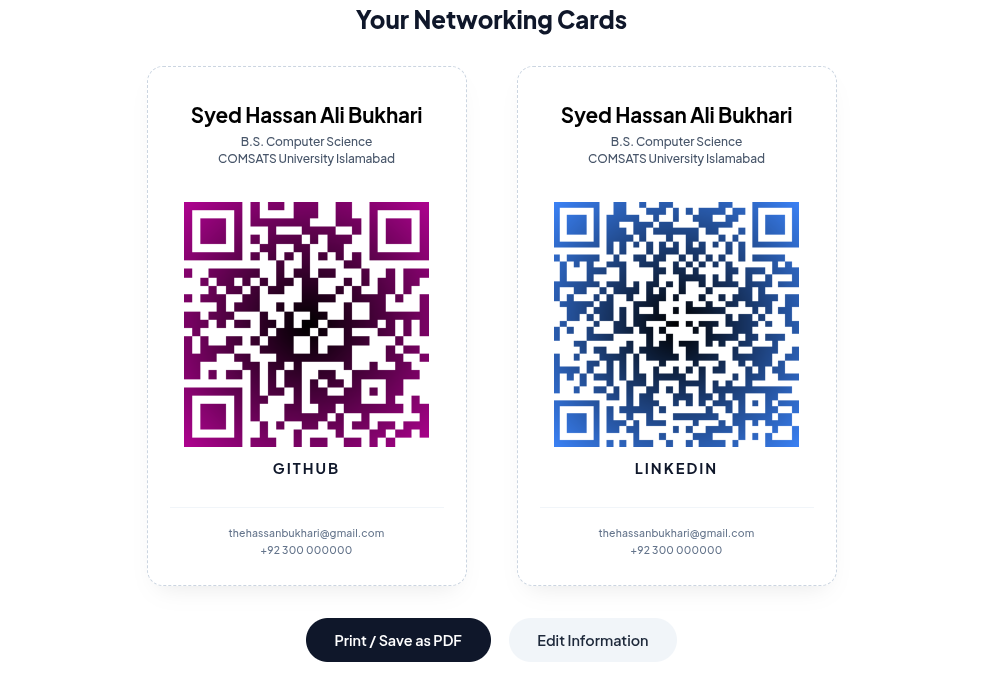

# NetCard

NetCard is a lightweight web application that generates professional networking cards with QR codes for instantly sharing social profiles and contact information.

## Why I built this

I first noticed this idea during a hackathon where people were using physical networking cards. Most of them were manually designed using tools like Word or Canva, which took time and felt repetitive.

Each card usually contained a social profile such as GitHub or LinkedIn. The concept was simple: scan a QR code and instantly access someone's profile without searching or exchanging contact details manually.

I liked the idea and decided to create a faster and more convenient solution.

When I tried making similar cards in MS Word, the process became messy and time consuming. Later, I needed to create cards for a friend as well, which made it clear that this workflow should be automated.

So I built NetCard.

## What it does

NetCard lets you:

- Generate networking cards with QR codes
- Create two cards for different social platforms
- Use predefined or custom platforms
- Customize QR code colors
- Preview cards instantly
- Print or save cards as PDF

## Features

- Client side QR code generation
- Custom QR code colors
- Support for GitHub, LinkedIn, Twitter, Instagram, YouTube, and custom links
- Dual card generation per profile
- Print ready A4 layout
- One click PDF export through browser printing
- Fully client side with no backend required
- Single HTML file deployment

## Live Demo

Try it here:

https://thehassanbukhari.github.io/NetCard/

Hosted using GitHub Pages.

## Generated Networking Cards

## Tech Stack

- HTML
- CSS
- JavaScript
- QRCode.js

## How to use

1. Enter your personal information
2. Add links for your social profiles
3. Choose QR code colors
4. Generate your networking cards
5. Preview the result
6. Print or save as PDF

## Output

Each generated card contains:

- Name
- Academic or professional details
- QR code linked to a profile
- Platform label
- Email address
- Phone number

  

## License

MIT License
